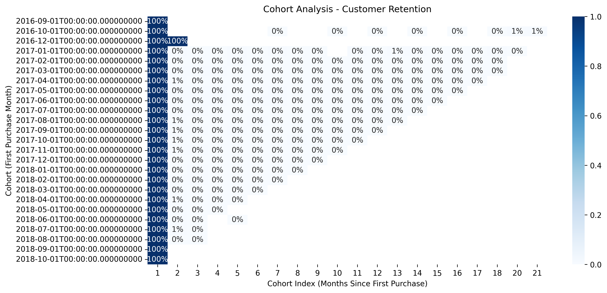

# 📊 E-commerce Funnel & Cohort Retention Analysis

## Overview
Analyzed **100k+ Brazilian e-commerce orders** (2016–2018) to uncover insights on customer acquisition, conversion, and retention.  
This project simulates real-world growth analytics tasks relevant for companies like **Meesho**.

## Key Findings
- **Funnel Conversion:** 98% orders successfully delivered; cancellations <1%.  
- **Basket Size:** Average 1.14 items/order with ~$160 average order value.  
- **Customer Retention:** <25% users return after Month 1 → showing weak repeat stickiness.  

## Business Impact
- Growth is **highly dependent on new user acquisition**.  
- Opportunity to launch **loyalty/referral programs** to increase retention.  
- Potential to **increase basket size** via bundles & promotions.  

## Tools Used
- Python (Pandas, Numpy, Matplotlib, Seaborn)  
- Jupyter / Google Colab  

## Visuals
### Funnel Analysis

### Cohort Retention Heatmap

